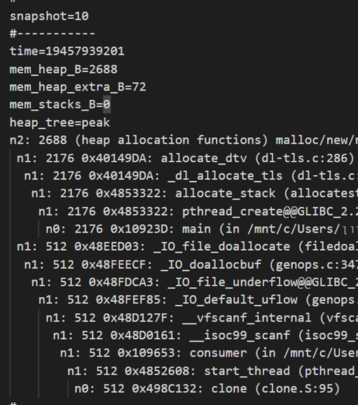
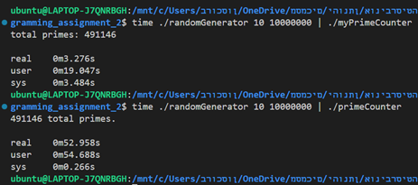

# Multy Threaded Prime Finder

### Authors:
- Yehonatan Baruchsom

### Abstract:
This task is part of the course "Advanced Programming". The objective was to enhance threading skills by processing an endless data stream efficiently. Specifically, we simulated a continuous stream of data using a random number generator and counted the number of prime numbers within this stream. The goal was to parallelize the process to utilize all available CPU cores while adhering to a strict memory constraint of 2MB and finding all prime numbers in the shortest time possible.

## Implementation Roadmap
### Optimize isPrime Function:

- Enhance the efficiency of the isPrime function to minimize computational overhead: using Miller Rabin method 

### Parallelization Strategy:

- Design a multithreaded approach to leverage all CPU cores:
    Distribute the workload of checking prime numbers across multiple threads.
    Implement thread-safe data structures for communication and synchronization.

### Validation and Testing:

- Validate correctness and performance of the implementation:
    Compare results against primeCounter with a large dataset (e.g., 10 million numbers).
    Verify memory usage does not exceed 2MB under different scenarios.


## Usage:
Clone the repository to your local machine:
```bash
git clone https://github.com/yehonatanBar61/Advanced_programming_assignment_2.git
```
navigate to Advanced_programming_assignment_2 folder and compile the program using the makefile:
```bash
make all
```
run the program:
for exmple with 10,000,000 random numbers and seed = 10
```bash
./randomGenerator 10 10000000 | ./primeCounter
```

## Images:



